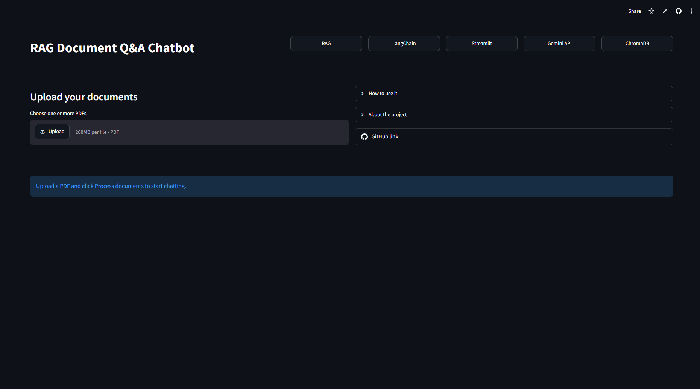
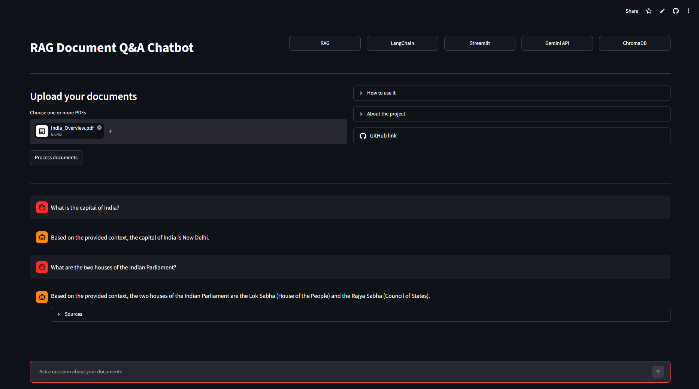
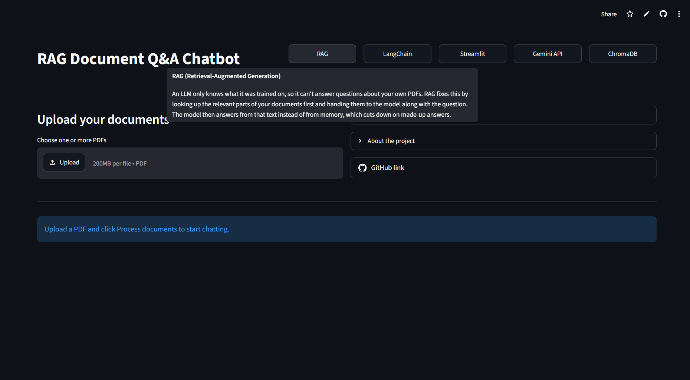

# Document Q&A Chatbot

Upload a PDF and ask questions about it in plain English. Every answer is written only from your document, and the passages used are shown underneath so you can check them.

## How it works

1. **Upload:** the app reads the PDF text page by page.
2. **Split:** the text is cut into chunks of about 1,000 characters with a 200-character overlap.
3. **Embed:** each chunk is turned into numbers by a Gemini embedding model.
4. **Store:** the embeddings, text, file name, and page number are saved in ChromaDB.
5. **Retrieve:** your question is embedded the same way, and the 4 closest chunks are pulled.
6. **Answer:** the chunks and your question go to a Gemini chat model, which answers only from that text or says it doesn't know.
7. **Sources:** each answer shows the file name and page of the chunks used.

## Built with

Python, LangChain, ChromaDB, Google Gemini API, Streamlit

## Project structure

- `app.py`: the Streamlit interface
- `rag/loader.py`: reads and splits PDFs
- `rag/vectorstore.py`: embeddings and ChromaDB
- `rag/chain.py`: retrieval and answer generation

## Run it yourself

1. Clone the repository and open the folder.
2. Create and activate a virtual environment.
3. Install packages: `pip install -r requirements.txt`
4. Copy `.env.example` to `.env` and put your Gemini API key after `GEMINI_API_KEY=`. You can get a free key from Google AI Studio.
5. Start the app: `streamlit run app.py`

## Limitations

- Scanned PDFs (images of text) can't be read, only PDFs with selectable text.
- The free Gemini tier has rate limits, so large files may be slow.
- Avoid uploading confidential documents on the free tier.
